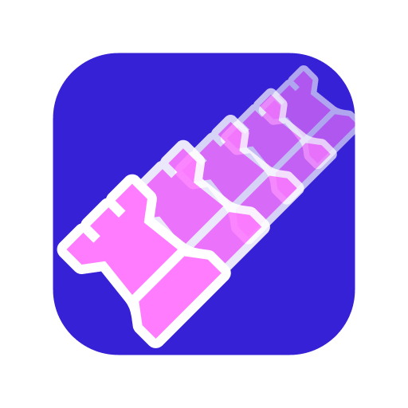

# Infinichess



**Massively multiplayer chess on an infinite, persistent board.**

Players spawn as a King, capture AI and other players to evolve through Knight → Bishop/Rook → Queen, and compete for the all-time leaderboard. The world persists across server restarts.

[](https://infinichess.io)
[](https://discord.com/invite/tvbEDUZvvB)

---

## Table of Contents

- [Features](#features)
- [Quick Start](#quick-start)
- [Architecture](#architecture)
- [Network Protocol](#network-protocol)
- [Game Mechanics](#game-mechanics)
- [AI System](#ai-system)
- [File Structure](#file-structure)
- [Deployment](#deployment)
- [Configuration](#configuration)
- [Project History](#project-history)
- [Known Issues & Roadmap](#known-issues--roadmap)
- [Contributing](#contributing)
- [License](#license)

---

## Features

- **Infinite World** — no boundaries, coordinate range ±2 billion (Int32)
- **Evolution System** — King → Knight (3 kills) → Bishop or Rook (6 kills) → Queen (10 kills)
- **Move Range Scaling** — sliding pieces gain +1 range per kill (base 3, cap 22)
- **AI Opponents** — up to 60 AI pieces that hunt, capture, and evolve
- **Persistent World** — neutral pieces, leaderboard, and all-time top 3 saved to disk
- **Real-time Chat** — floating bubbles above pieces + sidebar log
- **Spectator Mode** — watch without spawning
- **Player Customization** — name + 8 pastel color choices, saved to localStorage
- **Spawn Immunity** — 3-second shield after spawning
- **Viewport Broadcasting** — server only sends data relevant to each player's screen
- **Mobile Support** — touch controls, pinch-to-zoom, responsive UI
- **Analytics** — PostHog integration for error tracking and gameplay events
- **Auto-Reconnect** — exponential backoff reconnection (up to 8 attempts)

---

## Quick Start

### Prerequisites

- **Node.js 20+** (see `engines` in package.json)
- **npm**

### Install & Run

```bash
git clone https://github.com/updogjp/infinichess.git
cd infinichess
npm install

# Development (auto-restart on file changes)
npm run dev

# Production
npm start
```

Open **http://localhost:3000** in your browser.

### npm Scripts

| Script          | Description                                        |
| --------------- | -------------------------------------------------- |
| `npm start`     | Start the production server                        |
| `npm run dev`   | Start with nodemon (hot reload on file changes)    |
| `npm run build` | Syntax-check server + copy client files to `dist/` |
| `npm run clean` | Delete `server/*.dat` save files                   |

### Development Notes

- Server auto-detects `NODE_ENV=development` and bypasses captcha
- Nodemon watches `server/`, `shared/`, `client/` for `.js`, `.json`, `.html`, `.css` changes
- 500ms debounce on file changes before restart
- WebSocket clients auto-reconnect after server restart
- No build step required for the client — scripts load via `<script>` tags

---

## Architecture

```
Browser                          Server (Node.js + uWebSockets.js)
┌──────────────┐   WebSocket    ┌──────────────────────────────────┐
│ index.html   │◄──(binary)────►│ index.js                         │
│ input.js     │                │   WebSocket + HTTP handlers      │
│ client.js    │                │   Game logic (move, capture)     │
│ networking.js│                │   AI system (spawn, move, cull)  │
│              │                │   Persistence (world, players)   │
│ Shared:      │                │   Leaderboard + all-time top 3   │
│ constants.js │────────────────│   Rate limiting                  │
│ (SpatialHash,│                │                                  │
│  move rules) │                │ Save files:                      │
└──────────────┘                │   world.dat    (binary Int32)    │
                                │   players.dat  (JSON)            │
                                │   top3.json    (JSON)            │
                                └──────────────────────────────────┘
```

### Tech Stack

| Layer         | Technology                                                          |
| ------------- | ------------------------------------------------------------------- |
| **Frontend**  | Vanilla JS, HTML5 Canvas, CSS3                                      |
| **Backend**   | Node.js 20, uWebSockets.js                                          |
| **Protocol**  | Binary WebSocket (Int32Array for coords, Uint16Array for text/meta) |
| **Storage**   | Binary files (world), JSON (players, top3)                          |
| **Analytics** | PostHog (client-side)                                               |
| **Hosting**   | Render.com (server) + Cloudflare Pages (client)                     |

### Key Design Decisions

- **SpatialHash** (64×64 chunks, string keys) — shared between client and server for O(1) piece lookups and efficient spatial queries
- **Viewport-based broadcasting** — server only sends updates to clients whose camera viewport contains the affected square
- **Binary protocol** — minimal overhead; coordinate messages use Int32Array (supports negative/large coords), text messages use Uint16Array
- **No build step** — client scripts load in order via `<script>` tags; `constants.js` is shared by both client (browser global) and server (ESM import)

---

## Network Protocol

All communication is binary WebSocket. Messages are identified by a **magic number** in the first array element.

### Client → Server

| Magic          | Name          | Format        | Size           | Description                 |
| -------------- | ------------- | ------------- | -------------- | --------------------------- |
| 55551          | Player Info   | Uint8Array    | 8 + name bytes | Name, RGB color, piece type |
| 55552          | Camera Update | Int32Array(4) | 16 bytes       | Grid X, Grid Y, scale×100   |
| 55550          | Move Request  | Int32Array(5) | 20 bytes       | startX, startY, finX, finY  |
| 47095 (0xB7F7) | Chat          | Uint8Array    | 2 + text bytes | UTF-8 chat message          |

### Server → Client

| Magic | Name           | Format         | Size           | Description                            |
| ----- | -------------- | -------------- | -------------- | -------------------------------------- |
| 55553 | Viewport Sync  | Int32Array     | 16 + 16/piece  | Full viewport state (up to 500 pieces) |
| 55554 | Move Broadcast | Int32Array(6)  | 24 bytes       | startX, startY, finX, finY, playerId   |
| 55555 | Set Square     | Int32Array(5)  | 20 bytes       | x, y, pieceType, teamId                |
| 55556 | Spawn Immunity | Uint16Array(3) | 6 bytes        | playerId, duration (100ms units)       |
| 47095 | Chat Broadcast | Uint8Array     | 4 + text bytes | senderId + UTF-8 text                  |
| 48027 | Leaderboard    | Uint16Array    | variable       | Top 20 players with names + kills      |
| 48028 | All-Time Top 3 | Uint16Array    | variable       | Gold/silver/bronze with names + colors |
| 64535 | Neutralize     | Uint16Array    | 4 + 2/team     | Teams to convert to neutral            |

### ID Ranges

| Range       | Assignment           |
| ----------- | -------------------- |
| 1–9999      | Player IDs           |
| 10000–60000 | AI piece IDs         |
| 65534       | Server (chat sender) |

---

## Game Mechanics

### Evolution System

Players start as a **King** (1-square movement, all directions) and evolve by capturing pieces:

| Kills | Piece            | Movement                                             |
| ----- | ---------------- | ---------------------------------------------------- |
| 0     | King             | 1 square, 8 directions                               |
| 3     | Knight           | L-shape jumps (no range scaling)                     |
| 6     | Bishop _or_ Rook | Diagonal or orthogonal (deterministic per player ID) |
| 10    | Queen            | All 8 directions, range-scaled                       |

### Move Range

Sliding pieces (Bishop, Rook, Queen) have range that scales with kills:

```
range = min(22, 3 + kills)
```

- **Base**: 3 squares
- **Per kill**: +1 square
- **Cap**: 22 squares

Knights and Kings are unaffected (fixed movement patterns).

### Combat

| Mechanic       | Value                             |
| -------------- | --------------------------------- |
| Move cooldown  | 1.5 seconds                       |
| Respawn time   | 5 seconds                         |
| Spawn immunity | 3 seconds (removed on first move) |

- Capturing an **AI piece** → +1 kill, evolution check
- Capturing a **player piece** → +1 kill, victim eliminated + respawned
- Capturing a **neutral piece** → the captured piece spawns as yours at the origin square
- On death, kills reset to 0 and you restart as King

### Spawn Rules

- **Infinite mode**: Players spawn within 30 grid squares of the cluster center (average of all player positions)
- **64×64 mode**: Random placement on the board
- Kings cannot spawn within 4 squares of other kings/players
- Spawn location must have at least 1 legal move

---

## AI System

The server runs an autonomous AI system with configurable behavior:

| Parameter          | Default | Description                                     |
| ------------------ | ------- | ----------------------------------------------- |
| `baseCount`        | 12      | AI pieces when 0 players online                 |
| `soloBonus`        | 8       | Extra AI for a single player                    |
| `piecesPerPlayer`  | 2       | Additional AI per player beyond the first       |
| `maxAI`            | 60      | Hard cap on total AI pieces                     |
| `spawnRadius`      | 25      | Max spawn distance from a player (grid squares) |
| `engagementRadius` | 15      | Preferred spawn distance (70% chance)           |
| `removalRadius`    | 60      | Remove AI if farther than this from all players |
| `moveInterval`     | 800ms   | Minimum time between moves                      |
| `moveChance`       | 30%     | Probability of moving each tick                 |

### AI Behavior

1. **Spawn** near active players (biased toward engagement radius)
2. **Think** for 0–2 seconds before first move (staggered activation)
3. **Prioritize captures**: player pieces > neutral pieces > other AI
4. **Hunt**: scan 10-square radius for targets, move toward closest
5. **Evolve**: same kill→evolution thresholds as players
6. **Cull**: remove AI pieces that drift too far from all players

AI pieces use chess-themed names (e.g., "GrandGambit", "SilentFork") and pastel colors from a shared palette.

---

## File Structure

```
infinichess/
├── client/
│   ├── index.html          # Entry point: splash screen, setup modal, canvas, UI panels
│   ├── client.js           # Render loop, camera, input handling, visual effects, HUD
│   ├── input.js            # Keyboard/mouse/touch input, chat UI, leaderboard DOM
│   ├── networking.js       # WebSocket connection, message parsing, player setup, chat bubbles
│   ├── style.css           # Full UI styling (1700+ lines, responsive)
│   ├── _redirects           # Cloudflare Pages SPA routing
│   └── assets/
│       ├── infinichess.png       # Favicon
│       ├── infinichess_512.png   # Logo
│       ├── w{p,n,b,r,q,k}.png   # Chess piece sprites (white base, tinted at runtime)
│       ├── move{1,2}.mp3         # Move sounds
│       ├── capture{1,2}.mp3      # Capture sounds
│       └── gameover.mp3          # Death sound
├── server/
│   ├── index.js            # Server entry: WS/HTTP handlers, game logic, AI, persistence
│   └── badwords.js         # Chat filter word list (currently empty)
├── shared/
│   └── constants.js        # SpatialHash, piece types, move generation, evolution,
│                           #   chess notation, bad word filter, game constants
├── package.json            # Dependencies: uWebSockets.js, posthog-js, nodemon
├── nodemon.json            # Dev server config (watch dirs, extensions, delay)
├── render.yaml             # Render.com deployment config
├── AUDIT.md                # Full codebase audit with recommendations
├── DEPLOYMENT.md           # Deployment guide (Render + Cloudflare)
├── LICENSE                 # ISC License
└── README.md               # This file
```

### Data Files (gitignored, created at runtime)

| File                 | Format            | Description                          |
| -------------------- | ----------------- | ------------------------------------ |
| `server/world.dat`   | Int32Array binary | Neutral piece positions + types      |
| `server/players.dat` | JSON              | Player metadata (name, color, kills) |
| `server/top3.json`   | JSON              | All-time top 3 leaderboard           |

---

## Deployment

### Production Architecture

- **Backend**: Render.com web service (Node.js)
- **Frontend**: Cloudflare Pages (static files)
- **WebSocket**: `wss://api.infinichess.io` (production), `ws://localhost:3000` (dev)

### Render.com (Server)

Configured via `render.yaml`:

- Build: `npm install && npm run build`
- Start: `npm start`
- Environment: Node.js 20, `NODE_ENV=production`
- Port: assigned via `PORT` env var (default 3000)

### Cloudflare Pages (Client)

- Build: `npm run build`
- Output: `client/`
- SPA routing: `_redirects` → `/* /index.html 200`
- Auto-deploys on push to GitHub

See [DEPLOYMENT.md](DEPLOYMENT.md) for full setup instructions.

---

## Configuration

### Game Mode

In `server/index.js`:

```js
const GAME_CONFIG = {
  infiniteMode: true, // true = infinite world, false = 64x64 board
};
```

### AI Configuration

In `server/index.js`, the `AI_CONFIG` object:

```js
const AI_CONFIG = {
  enabled: true,
  verboseLog: false, // Log every AI move to console
  baseCount: 12,
  soloBonus: 8,
  piecesPerPlayer: 2,
  maxAI: 60,
  spawnRadius: 25,
  engagementRadius: 15,
  removalRadius: 60,
  moveInterval: 800,
  moveChance: 0.3,
  playerSpawnRadius: 30,
};
```

### Game Constants

In `shared/constants.js`:

| Constant              | Value  | Description                       |
| --------------------- | ------ | --------------------------------- |
| `moveCooldown`        | 1500ms | Time between player moves         |
| `respawnTime`         | 5000ms | Death → respawn delay             |
| `SPAWN_IMMUNITY_MS`   | 3000ms | Invincibility after spawn         |
| `CHUNK_SIZE`          | 64     | Spatial hash chunk size           |
| `MOVE_RANGE_BASE`     | 3      | Starting range for sliding pieces |
| `MOVE_RANGE_PER_KILL` | 1      | Range increase per kill           |
| `MOVE_RANGE_CAP`      | 22     | Maximum sliding range             |

### Persistence

| Setting                | Value            | Location               |
| ---------------------- | ---------------- | ---------------------- |
| Auto-save interval     | 2 minutes        | `server/index.js`      |
| Save on shutdown       | SIGINT + SIGTERM | `server/index.js`      |
| Viewport sync interval | 2 seconds        | `server/index.js`      |
| Camera update interval | 500ms            | `client/networking.js` |

---

## Project History

**Infinichess** is a fork of **[10kchess](https://github.com/pentaswan/10kchess)** by [@pentaswan](https://github.com/pentaswan).

### What Changed from the Original

| Area            | 10kchess                | Infinichess                                   |
| --------------- | ----------------------- | --------------------------------------------- |
| Board           | 64×64 fixed             | Infinite (Int32 coords)                       |
| Persistence     | None                    | Binary world save + JSON player data          |
| Player identity | Auto-generated          | Chosen name + color (8 pastels)               |
| Pieces          | Single piece per player | Evolution system (King → Queen)               |
| AI              | None                    | 12–60 autonomous AI with hunt/evolve behavior |
| Chat            | Sidebar only            | Floating bubbles + sidebar                    |
| Broadcasting    | All clients             | Viewport-based spatial filtering              |
| Protocol        | Uint16Array only        | Int32Array for coords, Uint16 for text        |
| Mobile          | Basic                   | Touch controls, pinch-zoom, responsive UI     |
| Analytics       | None                    | PostHog integration                           |
| Camera          | Fixed                   | Free pan, zoom (0.27×–6×), follow mode        |
| Death           | Instant respawn         | 5s cooldown, kill screen, spawn immunity      |
| Leaderboard     | Basic                   | Animated + all-time top 3                     |

---

## Known Issues & Roadmap

See [AUDIT.md](AUDIT.md) for the full codebase audit with prioritised recommendations.

### Known Issues

- AI kill counting may double-increment in some paths
- `badwords.js` is empty — server-side chat filter is ineffective
- Rainbow chat messages leak `setInterval` handles
- Force Respawn button can be used as a teleport exploit
- Static file serving has no path traversal protection

### Roadmap

- [ ] Message protocol schema (eliminate magic numbers, enable versioning)
- [ ] Split monolithic files into focused modules
- [ ] Client ES module migration (eliminate globals)
- [ ] Viewport spatial index for O(1) broadcasts
- [ ] Unit tests for game logic (moves, evolution, spatial hash)
- [ ] Session-based reconnection (resume after disconnect)
- [ ] Build pipeline (esbuild for bundling + minification)
- [ ] Draw call batching for large viewports

---

## Contributing

1. Fork this repository
2. Create a feature branch (`git checkout -b feature/my-feature`)
3. Review [AUDIT.md](AUDIT.md) for known issues and recommended improvements
4. Submit a pull request

### Code Style

- Vanilla JS, no framework dependencies on client
- Explicit type annotations in comments where helpful
- Descriptive comments for complex logic
- `font-seurat` class for text elements in UI
- Tailwind-style utility classes in CSS

---

## Credits

- **Original**: [10kchess](https://github.com/pentaswan/10kchess) by [@pentaswan](https://github.com/pentaswan)
- **Server**: [uWebSockets.js](https://github.com/uNetworking/uWebSockets.js)
- **Analytics**: [PostHog](https://posthog.com)
- **Sprites**: Standard chess piece set (white base, runtime-tinted)
- **Audio**: Move, capture, and game over sounds

## License

[ISC](LICENSE)
